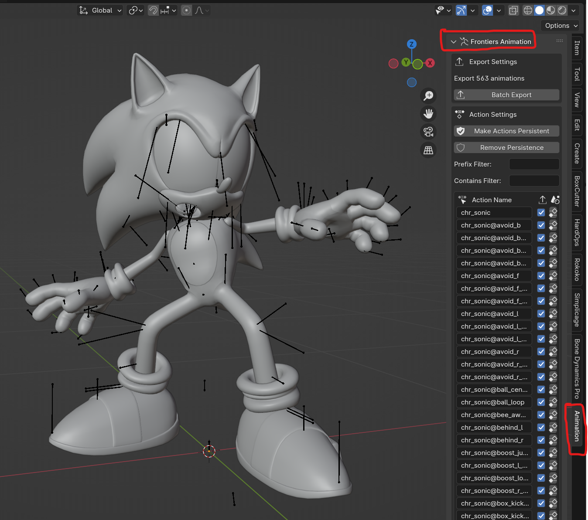
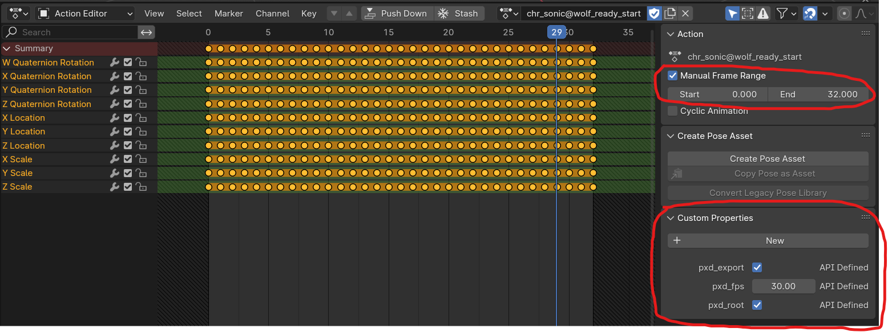

# Frontiers Animation Tools
Blender addon for importing and exporting compressed Hedgehog Engine 2 animations (.anm.pxd)

## Features:
- Skeleton reorientation
- Batch import as actions
- Batch export from actions
- Root motion as object transform
- Export visual with bone constraints

## Documentation:
*To-do: make this better*

In the meantime, just a couple notes:

- Batch exporting is found in the 3D viewports side menu under the "Animation" tab.

- A skeleton needs to be selected before importing an animation.
- Skeletons from ModelFBX outputs may differ from the .skl.pxd files. If you plan to re-export to the same existing skeletons, consider importing the .skl.pxd file separately and replacing the skeleton that came with the ModelFBX output.
- Importing a skeleton with YX orientation will support mirroring in Blender. Subsequent animations need to be imported and exported with YX orientation conversion enabled.
- The skeleton's native orientation should be Y up, and rotated +90deg along X to make it upright. Root motion imports and exports will base it's transformation off this orientation.
- Having lots of actions in a single Blend file will make Blender less responsive and use lots of memory. Try to keep the total number of actions low and maybe think twice before importing every animation at once. 
- Batch export frame range and FPS settings are pulled from each action's settings in the action editor. These are set when importing an animation and can be changed before exporting.

- When batch exporting, navigate to a folder you want each action to be exported to. Note that any existing animations in this folder will be overwritten.
- The UI may freeze while performing batch operations. Have the Blender console window open before performing a batch operation so you can see the progress of animations being imported/exported

## Credits:
- [ik-01](https://github.com/ik-01) for PXD format spec
- [WistfulHopes](https://github.com/WistfulHopes) for original compression/decompression and animation export tool, skeleton export function
- [Turk645](https://github.com/Turk645) for original uncompressed animation import tool, skeleton import function from [.model importer](https://github.com/Turk645/Hedgehog-Engine-2-Mesh-Blender-Importer)
- [nfrechette](https://github.com/nfrechette) for [acl](https://github.com/nfrechette/acl) and [rtm](https://github.com/nfrechette/rtm) libraries

